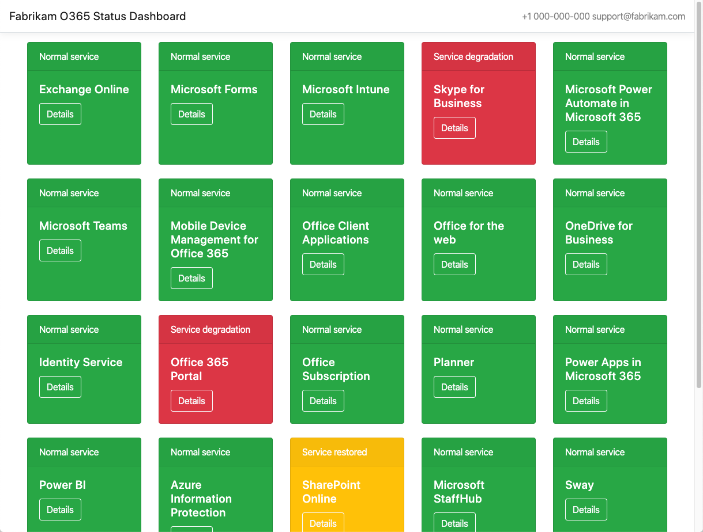
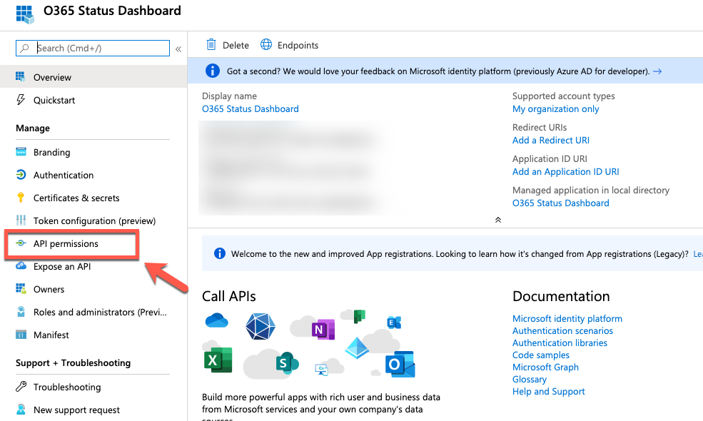
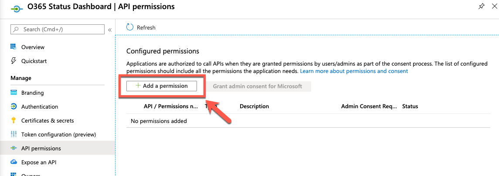
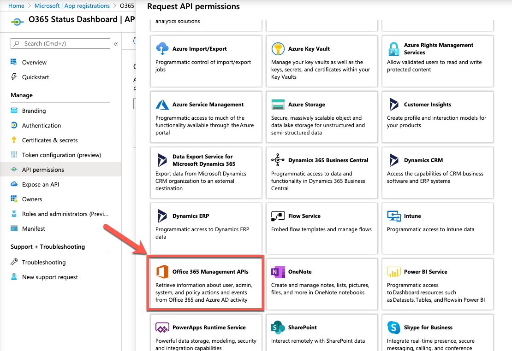
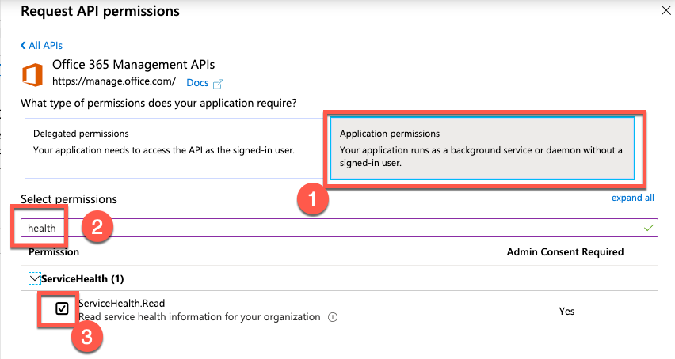
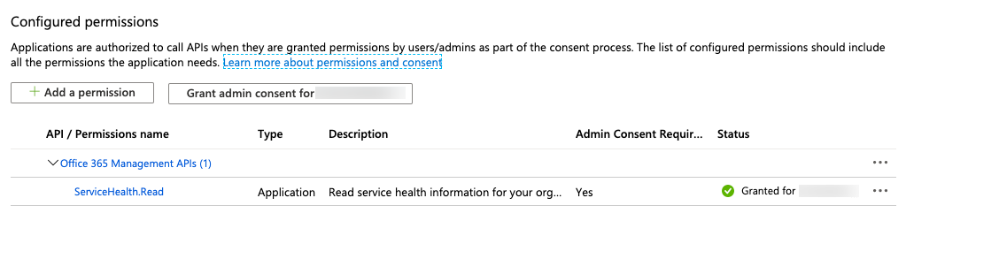
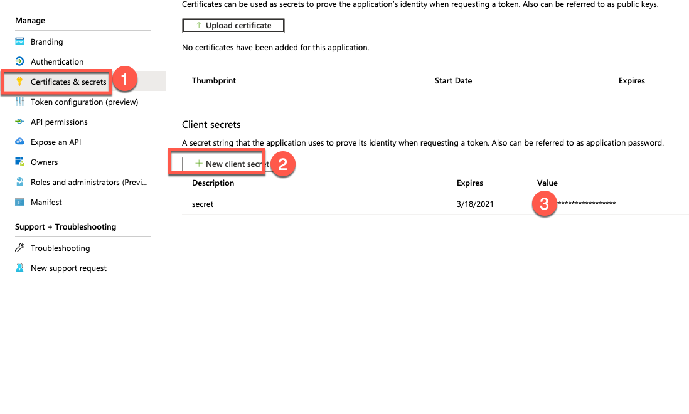

# O365 Status Dashboard

This is a simple O365 Status Dashboard that leverages the [O365 Service Health API](https://docs.microsoft.com/en-us/office/office-365-management-api/office-365-service-communications-api-reference) to provide non-admin users a quick status overview about their O365 infrastructure. 

## Overview

The status dashboard is a tiny ASP.NET Core MVC application that retrieves tenant-specific O365 status information. It is containerized and can run on Windows, Mac, and Linux.

[Live Demo](https://o365dashboard-e1ac.azurewebsites.net/) and screenshot:


## Setup

### Create AAD App Registration for Service Health API
The application needs a pre-configured service account to get access to the [O365 Service Health API](https://docs.microsoft.com/en-us/office/office-365-management-api/office-365-service-communications-api-reference).

1. Go to the [Azure Portal](https://portal.azure.com) and create a new Azure AD application ([quick link](https://portal.azure.com/#blade/Microsoft_AAD_IAM/ActiveDirectoryMenuBlade/RegisteredApps)).
2. In the 'Register an application' dialog, choose a meaningful display name for the application, e.g. "Contoso O365 Status Dashboard".
3. For 'Supported account types' choose 'Accounts in this organizational directory only (Microsoft only - Single tenant)'.
4. The 'Redirect URI' can be left empty.
5. Click 'Register'.

Configure the AAD App:

1. Select 'API permissions'

2. Remove any pre-configured permissions (usually 'Microsoft.Graph/User.Read').
3. Select 'Add a permission'

4. Choose 'Office 365 Management APIs'

5. Select 'Application permissions', search for 'health' and select the 'ServiceHealth.Read' permission.

6. Confirm with 'Add permissions'
7. Grant admin consent for the just created permission. You are done, when you see the green check mark.

8. Create a new secret and keep the created secret in a temporary scratch space (e.g. Notepad).


Collect the following values for the registered AAD App and keep them in a temporary scratch space - you will need them later:
* Tenant Host, e.g. contoso.onmicrosoft.com or contoso.com
* Tenant ID, e.g. 00000000-0000-0000-0000-000000000000
* Client ID also known as Application ID, e.g. 00000000-0000-0000-0000-000000000000
* Client Secret (you just created)

### Running the Dashboard Web App

You can either build the application from scratch, use the provided [Dockerfile](./O365StatusDashboard/Dockerfile) or run a pre-build docker image
from [Docker Hub](https://hub.docker.com/repository/docker/olohmann/o365-status-dashboard).

Here is a sample that uses the pre-built docker image:

1. Create a docker `env.list` file using the configuration from the App Registration:
```bash
ServiceHealthApiConfiguration__TenantHost=contoso.onmicrosoft.com
ServiceHealthApiConfiguration__TenantId=00000000-0000-0000-0000-000000000000
ServiceHealthApiConfiguration__ClientId=00000000-0000-0000-0000-000000000000
ServiceHealthApiConfiguration__ClientSecret=00000000-0000-0000-0000-000000000000
ServiceHealthApiConfiguration__CacheDurationInSeconds=60
CompanyConfiguration__CompanyName=Contoso
CompanyConfiguration__SupportEmail=support@contoso.com
CompanyConfiguration__SupportPhone=+1 000-000-000

# If you run in Azure, you can also inject and application insights instance.
ApplicationInsights__InstrumentationKey=00000000-0000-0000-0000-000000000000
```

2. Run the docker image
```bash
docker run --env-file env.list -p8080:8080 olohmann/o365-status-dashboard:latest
```

### Deploying the Dashboard Wep App in Azure

There is a fully functional terraform deployment in the folder [iac](./iac/). Use the [tfvars template](./iac/config_sample.tfvars) to customize the deployment.

You can **limit the access** to the dashboard by configuring the [Azure App Service AAD authentication](https://docs.microsoft.com/en-us/azure/app-service/configure-authentication-provider-aad) (also part of the Terraform deployment sample). 
By doing so, only employees of your enterprise can see the status.